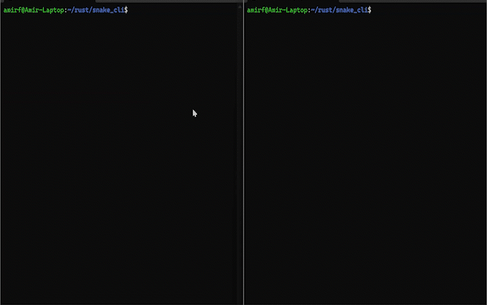

# snake_cli

A multiplayer Snake game you can play in the terminal, over a local network. Built in Rust, runs on Unix-based systems and Windows.

---

## Features

- Play Snake with friends: A host, Several clients.  
- Adjustable playground size (for example `20 × 120`).  
- You can resize your terminal window during gameplay.  
- Works over local networks — LAN play.  
- Cross-platform: Unix-based systems and Windows.

---

## Getting Started

### Prerequisites

- Rust and Cargo installed.  
- Network setup: all players must be on the same local network, and firewall settings must allow connections.  

### Installation

```bash
git clone https://github.com/amir-frjn/snake_cli.git
cd snake_cli
cargo build --release
```
---

## Usage

- Create a host
  ```bash
  snake_cli server --port <port>
  ```
  Or
  ```bash
  snake_cli server --port 1234 --width 120 --height 20
  ```
- Joining a game
  ```bash
  snake_cli client --host <host-ip-or-name> --port <port>
  ```

---

## Demo



